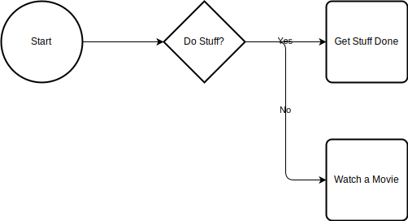
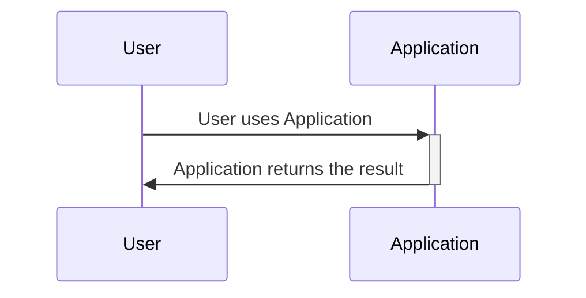

# Documentation Features

## Draw.io Diagram

You can embed draw.io diagrams directly like this.  Naming the files with .drawio.svg allows you to embed an editable diagram and easily edit with the vscode draw.io plugin

## Mermaid Diagrams

You can also directly embed mermaid diagrams like this

## Math Equations

You can embed a katex equation

### Testing KaTeX

This is the number $x = 13$ and this
$$
E = mc^2 + 2
$$

is an equation

## Embedding React Components

You can embed react components directly, here is a sample of putting the table of contents inline

### Inline Table of contents example

import TOCInline from '@theme/TOCInline';

<TOCInline toc={toc} />

### Tabs Example
Or this

import Tabs from '@theme/Tabs';
import TabItem from '@theme/TabItem';

<Tabs>
  <TabItem value="apple" label="Apple" default>
    This is an apple 🍎
  </TabItem>
  <TabItem value="orange" label="Orange">
    This is an orange 🍊
  </TabItem>
  <TabItem value="banana" label="Banana">
    This is a banana 🍌
  </TabItem>
</Tabs>