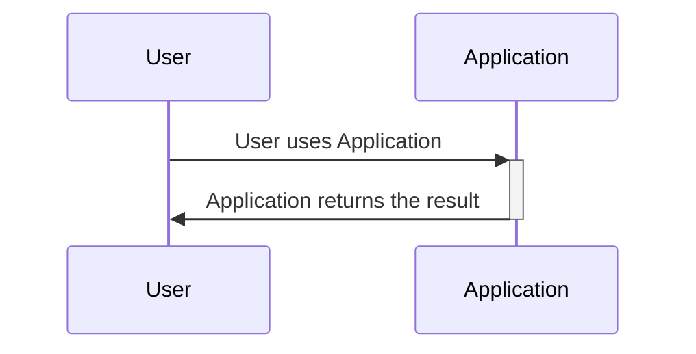

# Documentation Features


This document represents various examples of how to work with writing docs.  It is marked with a front matter block of

```markdown
---
draft: true
---

```

Which means it will not be published, so it's safe to keep this in the folder because it will not be include with npm run build

## Draw.io Diagram
You can embed draw.io diagrams directly like this.  Naming the files with .drawio.svg allows you to embed an editable diagram and easily edit with the vscode draw.io plugin.

Draw.io includes by default an SVG 1.1 compatibility warning.  Due to the nature of the tools used to build a docusaurus site will always show up if you embed a drawing this way.  

**To disable** this warning, in the draw.io editor, choose File -> Properties and disable the SVG 1.1 warning checkbox.

```jsx
import SampleDrawing from './feature_one.drawio.svg';

<SampleDrawing className="drawio" />

```

import SampleDrawing from './feature_one.drawio.svg';

<SampleDrawing className="drawio" />


## Mermaid Diagrams

You can also directly embed mermaid diagrams like this


```markdown
    ```mermaid
    sequenceDiagram
        participant User
        participant Application

        User->>+Application: User uses Application
        Application->>-User: Application returns the result
    ```
```




## Math Equations

You can embed a katex equation

### Testing KaTeX

```text
This is the number $x = 13$ and this
$$
E = mc^2 + 2
$$
```

This is the number $x = 13$ and this
$$
E = mc^2 + 2
$$

is an equation

## Embedding React Components

You can embed react components directly, here is a sample of putting the table of contents inline


### Inline Table of contents example

```jsx
import TOCInline from '@theme/TOCInline';

<TOCInline toc={toc} />
```

import TOCInline from '@theme/TOCInline';

<TOCInline toc={toc} />


### Tabs Example

Or this

```jsx
import Tabs from '@theme/Tabs';
import TabItem from '@theme/TabItem';

<Tabs>
  <TabItem value="apple" label="Apple" default>
    This is an apple 🍎
  </TabItem>
  <TabItem value="orange" label="Orange">
    This is an orange 🍊
  </TabItem>
  <TabItem value="banana" label="Banana">
    This is a banana 🍌
  </TabItem>
</Tabs>
```

import Tabs from '@theme/Tabs';
import TabItem from '@theme/TabItem';

<Tabs>
  <TabItem value="apple" label="Apple" default>
    This is an apple 🍎
  </TabItem>
  <TabItem value="orange" label="Orange">
    This is an orange 🍊
  </TabItem>
  <TabItem value="banana" label="Banana">
    This is a banana 🍌
  </TabItem>
</Tabs>
